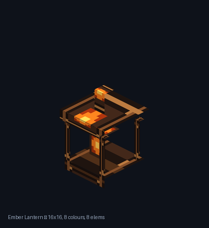
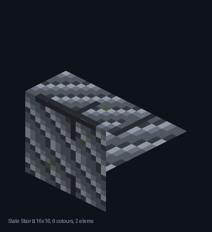
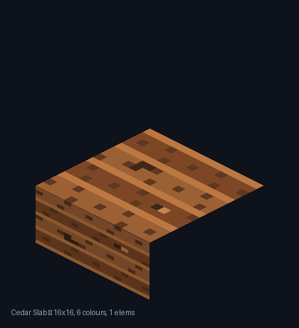
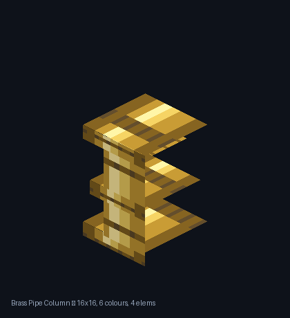
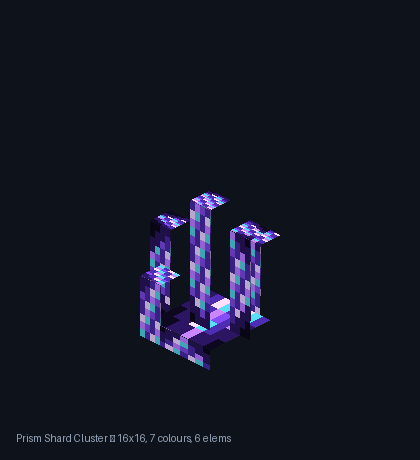
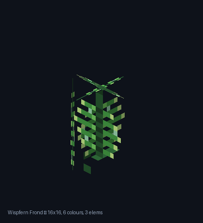
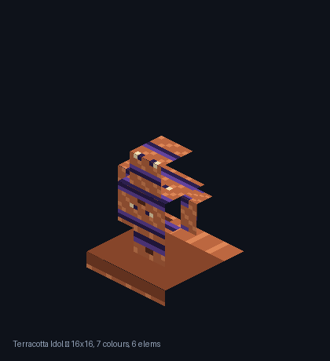
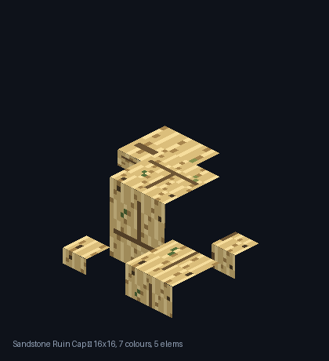
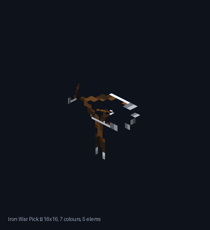
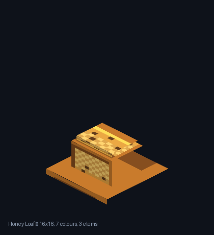

# Craftify Asset Gallery

Portfolio extras — **not** part of the Part 4 submission. The official Anchored Coral Block remains untouched in `assets/` (`block_texture.png`, `block_model.json`, `model_preview.png`).

Each entry includes a 16×16 texture, a Minecraft Java-format model, and an isometric preview rendered from that model’s elements.

Rebuild: `python assets/gallery/build_gallery.py`

| # | Name | Geometry | Theme | Colours | Elements |
|---|------|----------|-------|---------|----------|
| 01 | [Ember Lantern](#01-ember-lantern) | multi-part assembly | metal / ceremonial | 8 | 8 |
| 02 | [Slate Stair](#02-slate-stair) | stairs | stone | 6 | 2 |
| 03 | [Cedar Slab](#03-cedar-slab) | slab | wood | 6 | 1 |
| 04 | [Brass Pipe Column](#04-brass-pipe-column) | pillar/column with flange rings | metal / mechanical | 6 | 4 |
| 05 | [Prism Shard Cluster](#05-prism-shard-cluster) | multi-part | crystal | 7 | 6 |
| 06 | [Wispfern Frond](#06-wispfern-frond) | plant-like crossed thin planes + pot | organic / plant | 6 | 3 |
| 07 | [Terracotta Idol](#07-terracotta-idol) | statue | ceremonial / decorative | 7 | 6 |
| 08 | [Sandstone Ruin Cap](#08-sandstone-ruin-cap) | multi-part ruin assembly | ruins / ancient | 7 | 5 |
| 09 | [Iron War Pick](#09-iron-war-pick) | tool | metal / tool | 7 | 5 |
| 10 | [Honey Loaf](#10-honey-loaf) | multi-part | food | 7 | 3 |

---

## 01. Ember Lantern

**Concept:** A hanging brass cage lantern with a floating ember core — ceremonial light for dungeon halls.

**Theme / geometry:** metal / ceremonial — multi-part assembly (base, posts, flame, roof, hook)

**Texture:** [`texture.png`](01_ember_lantern/texture.png) — 16×16, **8** colours. **Model:** [`model.json`](01_ember_lantern/model.json) — 8 elements.

**AI-assisted step:** AI-assisted silhouette and palette design; script-based flat pixel painting and multi-cuboid isometric preview.

---

## 02. Slate Stair

**Concept:** A cracked grey slate stair block with a moss fleck — stone architecture, stepped geometry.

**Theme / geometry:** stone — stairs (bottom slab + raised step)

**Texture:** [`texture.png`](02_slate_stair/texture.png) — 16×16, **6** colours. **Model:** [`model.json`](02_slate_stair/model.json) — 2 elements.

**AI-assisted step:** AI-assisted crack/moss motif planning; script quantized the texture to a deliberate 6-colour slate palette.

---

## 03. Cedar Slab

**Concept:** A half-height cedar plank slab with warm grain and dark knots — simple wood flooring piece.

**Theme / geometry:** wood — slab (half-height cuboid)

**Texture:** [`texture.png`](03_cedar_slab/texture.png) — 16×16, **6** colours. **Model:** [`model.json`](03_cedar_slab/model.json) — 1 element.

**AI-assisted step:** AI-assisted wood-grain direction choice; script painted plank bands and knots on a 16×16 grid.

---

## 04. Brass Pipe Column

**Concept:** A vertical industrial brass pipe with flange rings — mechanical column for steampunk builds.

**Theme / geometry:** metal / mechanical — pillar/column with flange rings

**Texture:** [`texture.png`](04_brass_pipe_column/texture.png) — 16×16, **6** colours. **Model:** [`model.json`](04_brass_pipe_column/model.json) — 4 elements.

**AI-assisted step:** AI-assisted flange spacing and oil-stain accents; script rendered cylindrical shading bands.

---

## 05. Prism Shard Cluster

**Concept:** A cluster of violet-teal crystal shards erupting from a dark base — vibrant crystal formation.

**Theme / geometry:** crystal — multi-part (5 shards + base)

**Texture:** [`texture.png`](05_prism_shard_cluster/texture.png) — 16×16, **7** colours. **Model:** [`model.json`](05_prism_shard_cluster/model.json) — 6 elements.

**AI-assisted step:** Concept source: [`concept.png`](05_prism_shard_cluster/concept.png). Cursor image generation produced concept.png (violet/teal facets); script collapsed the motif into a flat 16×16 7-colour sheet and built the shard cuboids.

---

## 06. Wispfern Frond

**Concept:** A glowing fern frond on crossed thin planes — plant-like item that reads from all angles.

**Theme / geometry:** organic / plant — plant-like crossed thin planes + pot

**Texture:** [`texture.png`](06_wispfern_frond/texture.png) — 16×16, **6** colours. **Model:** [`model.json`](06_wispfern_frond/model.json) — 3 elements.

**AI-assisted step:** Concept source: [`concept.png`](06_wispfern_frond/concept.png). Cursor image generation produced concept.png (glowing frond motif); script redrew it as a transparent 16×16 cross-plane plant sheet.

---

## 07. Terracotta Idol

**Concept:** A small painted clay idol with plinth, torso, head, and arms — ceremonial statue silhouette.

**Theme / geometry:** ceremonial / decorative — statue (6 cuboids forming a figure)

**Texture:** [`texture.png`](07_terracotta_idol/texture.png) — 16×16, **7** colours. **Model:** [`model.json`](07_terracotta_idol/model.json) — 6 elements.

**AI-assisted step:** Concept source: [`concept.png`](07_terracotta_idol/concept.png). Cursor image generation produced concept.png (clay + ceremonial paint); script cleaned to a flat 16×16 palette and assembled the statue cuboids.

---

## 08. Sandstone Ruin Cap

**Concept:** A broken sandstone column stump with fallen blocks and rubble — ancient desert ruins fragment.

**Theme / geometry:** ruins / ancient — multi-part ruin assembly (stump, broken cap, fallen block, rubble)

**Texture:** [`texture.png`](08_sandstone_ruin_cap/texture.png) — 16×16, **7** colours. **Model:** [`model.json`](08_sandstone_ruin_cap/model.json) — 5 elements.

**AI-assisted step:** AI-assisted ruin composition; script weathered the sandstone palette and placed rubble cuboids.

---

## 09. Iron War Pick

**Concept:** An item-style war pick with wrapped haft and double-spiked iron head — tool/weapon, not a block.

**Theme / geometry:** metal / tool — tool (haft + wrap + head bar + spikes)

**Texture:** [`texture.png`](09_iron_war_pick/texture.png) — 16×16, **7** colours. **Model:** [`model.json`](09_iron_war_pick/model.json) — 5 elements.

**AI-assisted step:** AI-assisted tool silhouette; script painted iron/haft pixels and built the item-style cuboid assembly.

---

## 10. Honey Loaf

**Concept:** A glazed honey loaf resting on a flat plate — warm bakery food prop.

**Theme / geometry:** food — multi-part (plate + loaf + glaze cap)

**Texture:** [`texture.png`](10_honey_loaf/texture.png) — 16×16, **7** colours. **Model:** [`model.json`](10_honey_loaf/model.json) — 3 elements.

**AI-assisted step:** AI-assisted crust/glaze palette; script painted crumb dither and stacked the plate/loaf/glaze cuboids.

---
